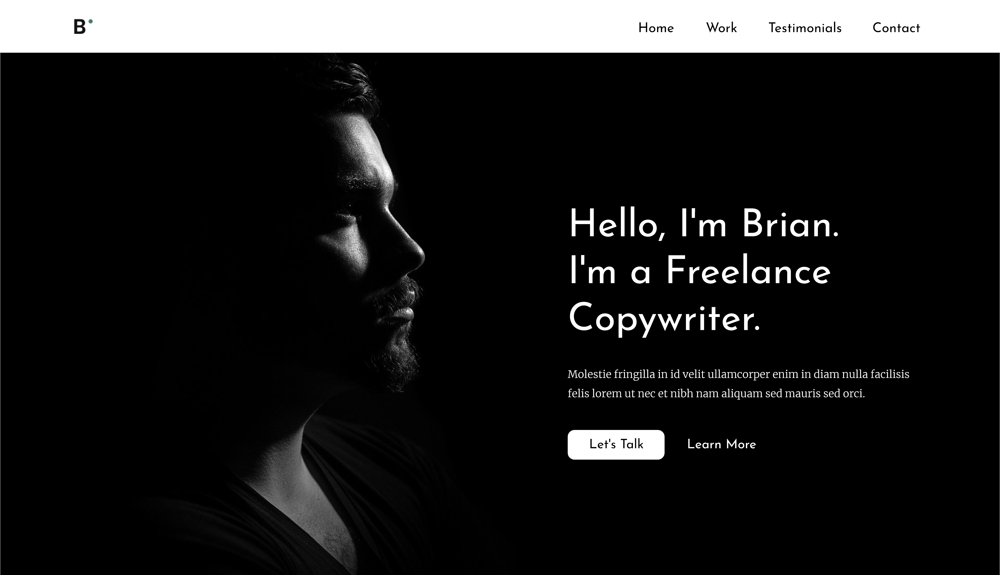

# Brian Freelance Copywriter

This site is a case study to practice the knowledge I have acquired in HTML and CSS.
Don't hesitate to tell me what you think and connect if you want.

See u soon ✌🏽

## 🛠️ **Built With**
- 

- 

- 

## 🔗 **Links**

- Live Site URL : [QR Code Component](https://dopekaribbean-qr-code.netlify.app)
[] Rendre le menu fixe lors du défilement de la page ;

## 🧠 **What I learned**

* Tried to do **clean code**
* Used HTML5 **semantic elements**
* Used CSS3 **propertises**
* Used **Git** and **GitHub** for project management